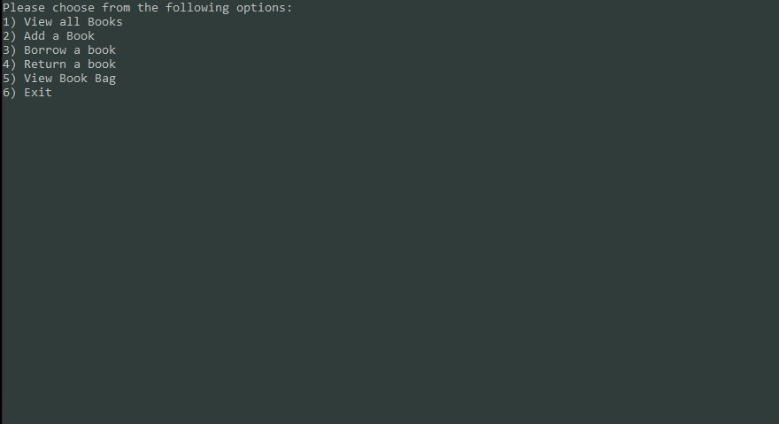
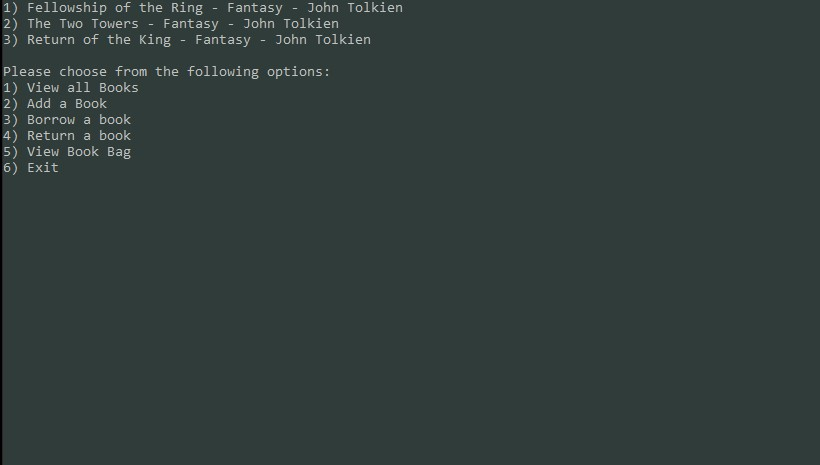
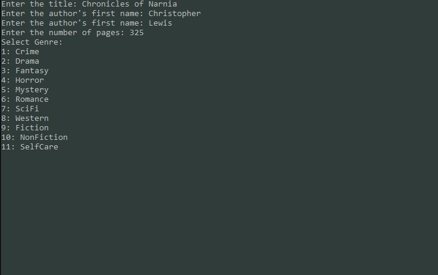
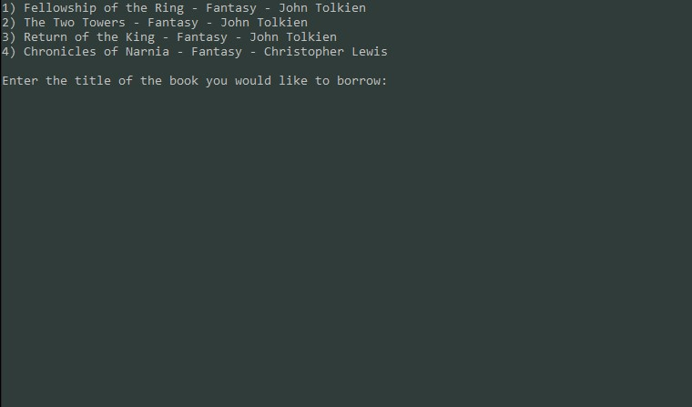
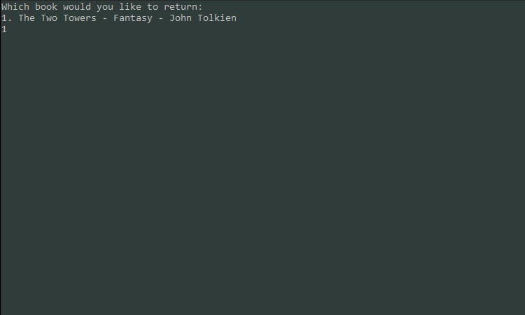
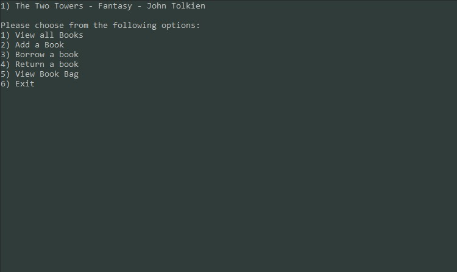
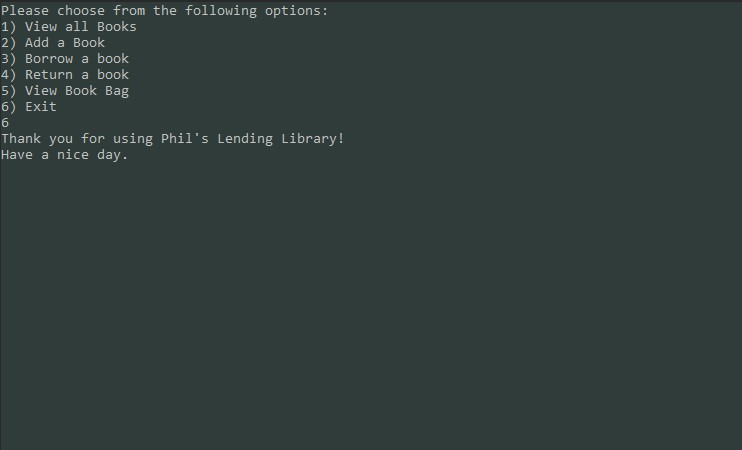

# Phil's-Lending-Library

Lab08

*Author: Andrew Smith*

---

### Description

Phils lending library acts as a virtual book locker where users can store there favorite books.
The user has the ability to view the current 'library'. They can also add books to this library.
If desired, the user can add one of the current books in the library to their 'bookbag'. This 
will remove the book from the library. They can then choose to 'return' the book back to the 
library, which then removes it from their bookbag. 

---

### Getting Started

Clone this repository to your local machine:
`$ git clone https://github.com/AndrewCS149/Phils-Lending-Library.git`

### To run this program from the windows command line

From project root directory, run:
1. `$ cd .\PhilsLendingLibrary\PhilsLendingLibrary\bin\Debug\netcoreapp3.1\`
2. `$ dotnet .\PhilsLendingLibrary.dll`

---

### To run this program from the File Explorer

1. Navigate to: `Phils-Lending-Library\PhilsLendingLibrary\PhilsLendingLibrary\bin\Debug\netcoreapp3.1`
2. Open `PhilsLendingLibrary.exe`

---

### Visuals

**Menu**

**View all books**

**Add a book**

**Borrow a book**

**Return a book**

**View book bag**

**Exit application**

---

### Change Log

- 1.16 Add visuals to README - July 16 2020
- 1.15 Fully functioning application - July 16 2020
- 1.14 Bug Fixes - July 16 2020
- 1.13 ExitMessage() - July 16 2020
- 1.12 RemoveBook() - July 16 2020
- 1.11 GenreSelection() - July 16 2020
- 1.10 DisplayGenres() - July 16 2020
- 1.9 ReturnBook() - July 16 2020
- 1.8 Borrow() - July 16 2020
- 1.7 ViewBookBag() - July 15 2020
- 1.6 GetBookBagDetails() - July 15 2020
- 1.5 GetBookDetails() - July 15 2020
- 1.4 AddABook() - July 15 2020
- 1.3 ViewBooks() - July 15 2020
- 1.2 Load bookbag with inital books - July 15 2020
- 1.1 Created menu - July 15 2020
